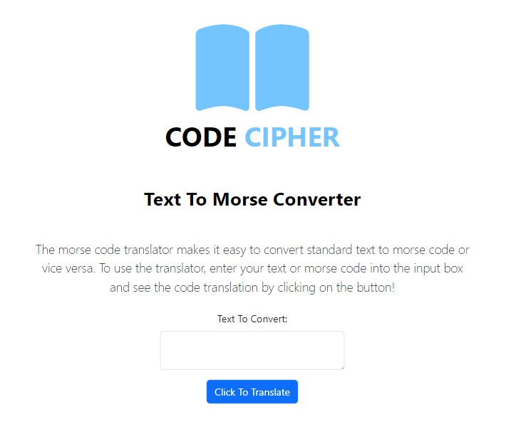

# Text to Morse Code Converter

This is a simple web application developed using Python, Flask, WTForms, and Bootstrap, allowing users to convert text input into Morse code and vice versa.

## Table of Contents

- [Overview](#overview)
  - [Features](#features)
  - [Screenshot](#screenshot)
  - [Links](#links)
- [My Process](#my-process)
  - [Technologies Used](#technologies-used)
  - [Installation](#installation)
  - [What I Learned](#what-i-learned)
  - [Continued Development](#continued-development)
- [Author](#author)

## Overview

### Features

- Convert text input into Morse code or vice versa.
- Clean and user-friendly interface.
- Responsive design using Bootstrap for optimal viewing on various devices.

### Screenshot

### Links

- Code URL: [GitHub](https://github.com/KatrineNPedersen/Text-To-Morse-Converter.git)
- Live Site URL: [Render](https://katrine-pedersen-text-to-morse-converter.onrender.com)

## My Process

### Technologies Used

- Python: Backend language for handling text input and Morse code conversion logic.
- Flask: Micro web framework for routing and handling HTTP requests.
- WTForms: Form validation and rendering library for Flask.
- Bootstrap: Frontend framework for designing responsive and mobile-first websites.

### Installation

- Clone repository:
  git clone https://github.com/KatrineNPedersen/Text-To-Morse-Converter.git
- Navigate to Project Directory:
  cd Text-To-Morse-Converter
- Install dependencies:
  pip install -r requirements.txt

### What I Learned

This app provided me with several learning opportunities including:
- Strengthened python skills: string manipulation and basic algorithm implementation for Morse code conversion
- Working with Flask: Experience in building web applications using a microframework, including routing, handling HTTP requests and rendering templates
- Integrating WTForms: How to create forms and validate user input
- Bootstrap Design: Insights into building responsive and visually appealing user interfaces

### Continued Development

This is a simple version of a Text to Morse Converter with basic functionalities and could potentially be improved by adding:
- Error Handling
- User Authentication
- Unit Testing
- Integration with External APIs

## Author

- Github - [Katrine N Pedersen](https://github.com/KatrineNPedersen)